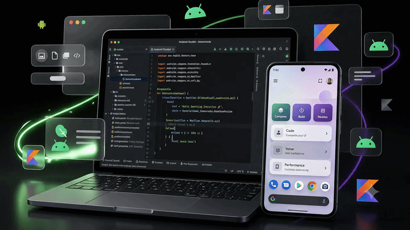

  

<h1 align="center">
   Hey, I'm <b>Vedant Raut</b>!
</h1>

  <strong>Software Development Engineer @ Logituit | Android & Kotlin Multiplatform Developer</strong>

  
  
  

---

## 🚀 About Me

<table border="0" width="100%">
  <tr>
    <td width="60%" valign="top">
      
I'm a passionate <b>Software Development Engineer</b> at <b>Logituit</b> dedicated to crafting smooth mobile user experiences and modular cross-platform architectures.

      <ul>
        <li>💼 Currently building scalable mobile solutions at <b>Logituit</b>.</li>
        <li>📱 Specializing in <b>Kotlin</b>, <b>Jetpack Compose</b>, and <b>Kotlin Multiplatform (KMP)</b>.</li>
        <li>🌐 Comfortable across the stack, developing responsive frontends (React.js) and robust backends (Node.js/Express).</li>
        <li>🧠 Passionate about Clean Architecture, performance optimization, and clean, readable code.</li>
      </ul>
      
<i>"Clean code is not written by following rules. It is written through learning, experimentation, and continuous improvement."</i>

    </td>
    <td width="40%" align="center" valign="middle">
      
    </td>
  </tr>
</table>

---

## 🛠️ My Tech Stack

  <table border="0" width="100%">
    <tr>
      <td align="center" valign="top" width="25%">
        <h4>📱 Mobile Development</h4>
          
          
          
        
      </td>
      <td align="center" valign="top" width="25%">
        <h4>🌐 Web Frontend</h4>
        

           &nbsp;
            
           &nbsp;
          
        

      </td>
      <td align="center" valign="top" width="25%">
        <h4>⚙️ Backend & DB</h4>
          
          
          
        
      </td>
      <td align="center" valign="top" width="25%">
        <h4>🔧 Tools & Concepts</h4>
          
          
          
        
      </td>
    </tr>
  </table>

---

## 📂 Focus Areas & Specialization

<table align="center" border="0" width="100%">
  <tr>
    <td width="33%" align="center" valign="top">
        
      <h4><b>Modern Mobile Architecture</b></h4>
      
Building scalable Android apps with clean architecture, single source of truth, and modular code structures.

    </td>
    <td width="33%" align="center" valign="top">
        
      <h4><b>Kotlin Multiplatform (KMP)</b></h4>
      
Sharing business logic across platforms (Android/iOS) while preserving completely native UI execution.

    </td>
    <td width="33%" align="center" valign="top">
        
      <h4><b>Full-Stack Integration</b></h4>
      
Connecting elegant front-ends to reliable databases via robust RESTful APIs built on Node.js and Express.

    </td>
  </tr>
</table>

---

## 📸 Profile Showcase

  

---

## 📊 GitHub Analytics

  
  

  

---

## 🤝 Let's Connect

    
  
I am always looking forward to collaborating on innovative mobile projects or sharing development knowledge. Feel free to reach out!

