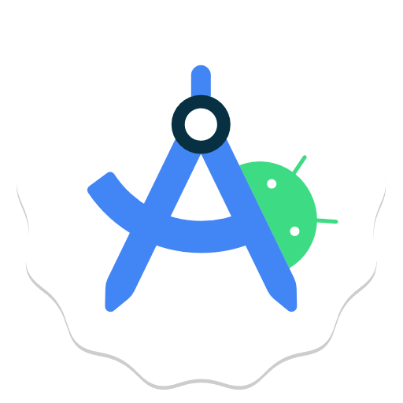

<h1 align="center" style=" padding-bottom: 10px;">Hi 👋, I'm VEDANT RAUT</h1>
<h3 align="center" style="">SDE @ Logituit | Android & KMP Developer | Kotlin & Jetpack Compose </h3>

  

## 🚀 About Me

- 💼 **Software Development Engineer (SDE) @ Logituit**
- 📱 Focused on building native Android apps and cross-platform mobile solutions using **Kotlin Multiplatform (KMP)**.
- 🎨 Passionate about declarative UI crafting clean experiences with **Jetpack Compose**.
- 🌐 Proficient in full-stack web architectures spanning React.js and Node.js.
- 🌱 Driven by performance optimizations, clean architecture patterns, and solid CS fundamentals.

 

---

## 🛠️ Technical Expertise

### 📱 Android & Kotlin Multiplatform (KMP)

  
  
  

### 🌐 Frontend & Web Technologies

  
  
  
  

### ⚙️ Backend Development & Databases

  
  
  
  

### 🛠️ Systems, Tools & Architecture

  
  
  
  
  
  

---

## 🌐 Connect With Me

  
  
  

---

## 📊 Development Activity

  
  

  

---

  <em>"Clean code is not written by following rules. It's written by experience, experimentation, and continuous learning."</em>

